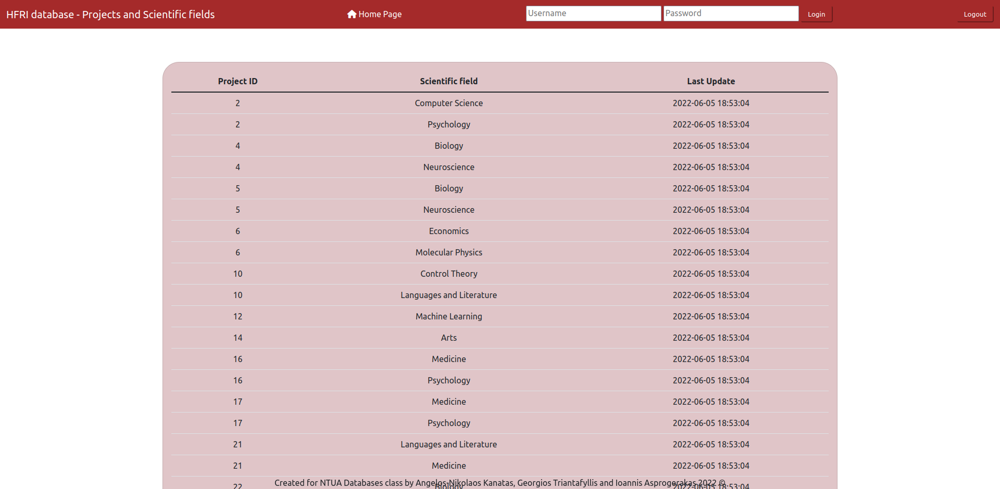

# HFRI (ELIDEK) database implementation project
A simple implementation for the needs of HFRI institute made with flask framework (python) for the backend, jinja template engine 
for HTML and CSS styling.

Team: Angelos-Nikolaos Kanatas, Georgios Triantafyllis, Ioannis Asprogerakas

## Prerequisite installation steps for Linux (Debian Core):

#### Get the latest version of Python and Flask framework:

``` bash
sudo apt-get update
sudo apt-get install python3.8
pip3 install -r requirements.txt
```

#### Download SQL development packages:

```bash
sudo apt install mysql-server
sudo mysql_secure_installation
```

## Prerequisite installation steps for macOS:

#### Download SQL development packages with homebrew package manager:

##### Homebrew package manager is needed to execute the following terminal instructions. 
##### You can find more about that here: https://brew.sh/index_el

```bash
/bin/bash -c "$(curl -fsSL https://raw.githubusercontent.com/Homebrew/install/HEAD/install.sh)"
brew install mysql
```

#### Get the latest version of Python and Flask framework:

``` bash
brew install python3
pip3 install -r requirements.txt
```

1. Open a terminal and precede the `mysql` command with `sudo` to invoke it with the privileges of the root Ubuntu user in order to gain access to the root MySQL user. This can be done using  
`sudo mysql -u root -p`.
2. Create a new MySQL user using:  
`mysql> CREATE USER 'HFRI_admin'@'localhost' IDENTIFIED BY 'admin';`
3. Grant the user root privileges on the application's database using:  
`mysql> GRANT ALL PRIVILEGES ON HFRI.* TO 'HFRI_admin'@'localhost' WITH GRANT OPTION;`
4. Reload the grant tables to ensure that the new privileges are put into effect using:
`FLUSH PRIVILEGES;`.
5. Exit MySQL with `mysql> exit;`.
7. Go to `HFRI/__init__.py` and change the `app.config["MYSQL_USER"]` and `app.config["MYSQL_PASSWORD"]` lines according to the username and the password you chose before.
8. Open the `sql` directory, type `sudo mysql -u root -p` and `source schema.sql`, `source insert-data.sql`, `source queries.sql` to create the database and pass all the nesessery data for it to work.  

##### If you are using macOS be carefull because Tables_in_HFRI migth be lowercase and that is going to cause some misfunctions. To solve that you have to manually change the variable Tables_in_HFRI -> Tables_in_hfri in the show_tables.html file located in the templates directory.

### To run the app type 
```python 
python3 run.py
``` 
### After that the app will run at http://localhost:5000/. Finally login to the database throught the site by using the same credentials as shown before to login into MySQL.

## Screenshots:





## License
[MIT](https://choosealicense.com/licenses/mit/)
